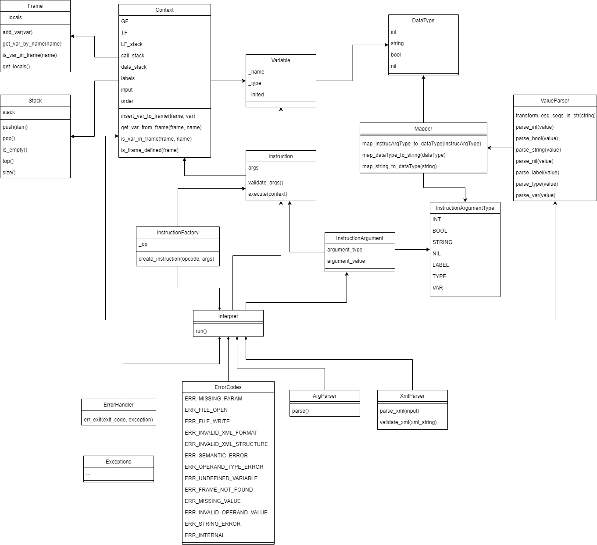

# Implementation documentation for the 2nd task for the IPP 2022/2023

Name and surname: Štefan Pekník
Login: xpekni01


## Usage

Interprates IPPcode23 language from parsed XML.

```python3.10 interpret.py --source=<source_file> --input=<input_file>```

At least one of the options has to be specified. 
If only one is specified, input of the other one is read from STDIN.


## Code structure

The program starts by running `Interpret` method `run()` which:

1. calls `ArgParser` to parse incomming command line arguments,
2. calls `XmlParser` to parse incomming XML containing parsed IPPcode23 code,
3. iterates over parsed XML and for each instruction parses instruction arguments into `InstructionArgument`, calls `InstructionFactory` to generate a specific `Instruction` based on `opcode` in XML and stores such instance in a dictionary with instruction order number,
4. sorts the instructions into list from the dictionary based on order number,
5. creates new `Context` which stores current information about current state of the interpretation,
6. iterates over instructions and executes only LABEL instructions (to find all labels that could be used to potential jump later),
7. resets `Context` order,
8. iterates over every instruction ignoring LABEL instructions (as those were already taken care of) and executes its method `execute` with current `Context` and the method returns modified `Context`.

Whole body of the method `run()` is encapsulated in a `try-except` block, which catches any potential expected exception, calls static method `err_exit` from `ErrorHandler` which prints the exception message end exits the program with an appropriate exit code.


#### XmlParser

`XmlParser` is used to parse the given XML into a structure that we can work with, the parsing is done using package `lxml`, the content of the XML is validated to match the given structure using this xml schema:
```
<xs:schema xmlns:xs="http://www.w3.org/2001/XMLSchema">

<xs:element name="program">
    <xs:complexType>
    <xs:sequence>
        <xs:element name="instruction" minOccurs="0" maxOccurs="unbounded" type="instructionType" />
    </xs:sequence>
    <xs:attribute name="language" type="xs:string" use="required" />
    <xs:attribute name="name" type="xs:string" use="optional" />
    <xs:attribute name="description" type="xs:string" use="optional" />
    </xs:complexType>
</xs:element>

<xs:complexType name="instructionType">
    <xs:all>
    <xs:element name="arg1" minOccurs="0" maxOccurs="1" type="argType" />
    <xs:element name="arg2" minOccurs="0" maxOccurs="1" type="argType" />
    <xs:element name="arg3" minOccurs="0" maxOccurs="1" type="argType" />
    </xs:all>
    <xs:attribute name="order" type="xs:positiveInteger" use="required" />
    <xs:attribute name="opcode" type="xs:string" use="required" />
</xs:complexType>

<xs:complexType name="argType">
    <xs:simpleContent>
    <xs:extension base="xs:string">
        <xs:attribute name="type" use="required">
        <xs:simpleType>
            <xs:restriction base="xs:string">
            <xs:enumeration value="int" />
            <xs:enumeration value="bool" />
            <xs:enumeration value="string" />
            <xs:enumeration value="nil" />
            <xs:enumeration value="label" />
            <xs:enumeration value="type" />
            <xs:enumeration value="var" />
            </xs:restriction>
        </xs:simpleType>
        </xs:attribute>
    </xs:extension>
    </xs:simpleContent>
</xs:complexType>

</xs:schema>
```


#### InstructionFactory

`InstructionFactory` is a factory for parsing instructions into appropriate instruction class and returns such created instance of the class.


#### Context

`Context` contains all information needed for each instruction execution, such as:
- GF - global frame
- TF - temporary frame
- LF_stack - stack of LFs (local frames)
- call_stack - stack of order numbers which are added using instruction `CALL`
- data_stack - stack for values pushed using instruction `PUSH` and popped using instruction `POP`
- labels - dictionary of: labels as keys, order numbers as values; used by `JUMP`-like instractions
- input - contains either `sys.stdin` or an openned file, on both instances can be used a method `readline()`
- order - current instruction number in the oteration process (in case of any jumps in the program this variable is modified and affects the iteration in the `run()` method of `Interpret`)


#### Instruction

Each instruction inherits from an abstract class `Instraction`, which implements two main methods: 
- `validate_args()` - used to validate that given arguments really do match requirements for the specific instruction,
- `execute(context)` - does the job which is expected from such instruction.

The usual practice is that at the start of each `execute` method a `validate_args` method is called, after that each the instruction uses its given arguments and does its required job.


#### Stack

For easier manimulation with data which should be stored in a stack a class `Stack` was created which abstracts basic python list.


#### Exceptions & ErrorCodes

For each error that could appear in the interpret an exception was created. It is expected to use appropriate error code from enum `ErrorCodes` for each caught exception.


## Class diagram of interpret

Each IPPcode23 instruction has its own class which inherits from abstract class Instruction, for simplification of the diagram it is not shown in it.


